# **M클래스 신청 API 서버 개발**

**트래픽 안정성을 고려한 Node.js 기반 M클래스 신청 API 서버 개발**

## 💻프로젝트 개요

### 프로젝트 목표

- 신청이 몰릴 수 있는 온라인 클래스 플랫폼의 신청 API 서버 구축
- 사용자 인증부터 M클래스 생성 및 신청, 신청자 제한 기능까지 구현

### 기술 스택

- Node.js 22.18.0
- 프레임워크: Express 5.1.0
- DB: PostgreSQL
- 인증: JWT
- 언어: TypeScript 5.9.2
- 테스트 도구: Jest 30.0.5, Supertest 7.1.4

## 🛠️프로젝트 세팅 및 실행

1. 의존성 설치
    
    ```bash
    npm install
    ```
    
2. 환경설정 파일 세팅
    
    `.env.example` 파일 참고하여 같은 위치에 `.env.development` 파일과 `.env.test` 파일 생성
    
    ```bash
    # DB 설정
    dbName=your_db_name
    dbUser=your_db_user
    dbPassword=user_db_password
    dbHost=localhost
    dbPort=5432
    
    # JWT 설정
    jwtSecretKey=your_jwt_secret_key
    jwtExpiresIn=your_jwt_expires_in
    jwtRefreshSecretKey=your_refresh_jwt_key
    jwtRefreshtExpiresIn=your_jwt_refresh_expires_in
    
    # 쿠키 설정
    cookieMaxAge=your_cookie_max_age
    ```
    
3. 마이그레이션
    
    ```bash
    npm run migration:create
    npm run migration:up
    ```
    
4. 실행 및 테스트
    - 서버 실행
        
        ```bash
        npm start
        ```
        
    - 테스트 실행
        
        ```bash
        # 테스트 전체 실행
        npm test
        
        # 유닛 테스트만 실행
        npm run test:unit
        
        # 통합 테스트만 실행
        npm run test:integration
        ```
        

## 📄API 명세

| **기능** | HTTP Method | URL | Authorization | Request | Response |
| --- | --- | --- | --- | --- | --- |
| 회원가입 | POST | /api/users/signup | ❌ | **Body**<br>username, name, password, email, phone | **Body - 유저 정보**<br>id, username, name, email, phone, createdAt |
| 로그인 | POST | /api/users/login | ❌ | **Body**<br>username, password | **Body - access token**<br>accessToken |
| 내 신청 내역 조회 | GET | /api/users/applications | ✅ | **Query string**<br>limit, last | **Body - 신청 정보 목록 (list)** <br>id, mclassId, title, startAt, endAt, fee, createdAt |
| M클래스 생성 | POST | /api/mclasses | ✅ | **Body**<br>title, description, maxPeople, deadline, startAt, endAt, fee | **Body - M클래스 정보**<br>id, title, description, maxPeople, deadline, startAt, endAt, fee, createdAt |
| M클래스 목록 조회 | GET | /api/mclasses | ❌ | **Query string**<br>limit, last | **Body - M클래스 정보 목록 (list)** <br>id, title, maxPeople, deadline, startAt, endAt |
| M클래스 상세 조회 | GET | /api/mclasses/:id | ❌ | 없음 | **Body - M클래스 정보**<br>id, title, description, maxPeople, deadline, startAt, endAt, fee |
| M클래스 삭제 | DELETE | /api/mclasses/:id | ✅ | 없음 | **Body - 삭제한 M클래스 id**<br>id |
| M클래스 신청 | POST | /api/mclasses/:id/apply | ✅ | 없음 | **Body - 신청 정보 id**<br>id |

### 회원가입 API

**POST /api/users/signup**

- Request Body
    
    
    | field | type | nullable | description |
    | --- | --- | --- | --- |
    | username | string | ❌ | 로그인 시 사용할 사용자 ID |
    | name | string | ❌ | 이름 |
    | password | string | ❌ | 비밀번호 |
    | email | string | ❌ | 이메일 |
    | phone | string | ✅ | 전화번호 |
    
    ```json
    {
      "username": "example",
      "password": "example pw",
      "name": "user name",
      "email": "example@example.com",
      "phone": "010-1234-5678"
    }
    ```
    
- Response Body
    
    
    | field | type | nullable | description |
    | --- | --- | --- | --- |
    | id | number | ❌ | 가입한 user id |
    | username | string | ❌ | 사용자 ID |
    | name | string | ❌ | 이름 |
    | email | string | ❌ | 이메일 |
    | phone | string | ✅ | 전화번호 |
    | createdAt | string | ❌ | 생성일시 |
    
    ```json
    {
      "id": 1,
      "username": "example",
      "name": "user name",
      "email": "example@example.com",
      "phone": "010-1234-5678",
      "createdAt": "2025-08-15T17:20:03.276Z"
    }
    ```
    
- 실패 메세지
    - HTTP status code 400
        - 유효성 검사 실패
        - 중복된 아이디입니다.
        - 중복된 이메일입니다.
        - 중복된 휴대폰 번호입니다.

### 로그인 API

**POST /api/users/login**

```
* 올바른 username과 password로 요청했을 시 JWT access token과 refresh token 발급
* refresh token은 cookie로 전송
```

- Request Body
    
    
    | field | type | nullable | description |
    | --- | --- | --- | --- |
    | username | string | ❌ | 사용자 ID |
    | password | string | ❌ | 비밀번호 |
    
    ```json
    {
      "username": "example",
      "password": "example pw"
    }
    ```
    
- Response Body
    
    
    | field | type | nullable | description |
    | --- | --- | --- | --- |
    | accessToken | string | ❌ | JWT access token |
    
    ```json
    {
      "accessToken": "${Access Token}"
    }
    ```
    
- 실패 메세지
    - HTTP status code 400
        - 유효성 검사 실패
    - HTTP status code 401
        - 로그인 실패

### 내 신청 내역 조회 API

**GET /api/users/applications**

```
* 현재 요청한 사용자가 신청한 M클래스 내역 최신순 조회
* 쿼리 스트링으로 조회 조건 설정
* cursor 기반 페이지네이션
```

- Authorization: JWT
- Query String
    
    
    | field | type | nullable | description |
    | --- | --- | --- | --- |
    | limit | number | ✅ | 한 번에 조회할 수 (default 10) |
    | last | number | ✅ | 마지막에 조회된 id (없을 시 가장 최신부터) |
- Response Body
    
    
    | field | type | nullable |  |
    | --- | --- | --- | --- |
    | list |  |  | 신청 내역 목록 |
    | list.id | number | ❌ | 신청한 application id |
    | list.mclassId | number | ❌ | 신청한 mclass id |
    | list.title | string | ❌ | 제목 |
    | list.startAt | string | ❌ | 시작일시 |
    | list.endAt | string | ❌ | 종료일시 |
    | list.fee | number | ❌ | 참가 비용 |
    | list.createdAt | string | ❌ | 신청일시 |
    
    ```json
    {
      "list": [
        {
          "id": 1,
          "mclassId": 1,
          "title": "example title",
          "startAt": "2026-08-15T03:00:00.000Z",
          "endAt": "2026-08-16T03:00:00.000Z",
          "fee": 1000,
          "createdAt": "2025-08-15T07:06:14.134Z"
        }
      ]
    }
    ```
    
- 실패 메세지
    - HTTP status code 400
        - 유효성 검사 실패
    - HTTP status code 403
        - 인증 실패

### M클래스 생성 API

**POST /api/mclasses**

```
* 관리자 전용
* 마감일시가 현재 시간 이하인 경우, 시작일시가 마감일시 이하인 경우, 종료일시가 시작일시 이하인 경우 생성 불가
```

- Authorization: JWT
- Request Body
    
    
    | field | type | nullable | description |
    | --- | --- | --- | --- |
    | title | string | ❌ | 제목 |
    | description | string | ✅ | 설명 |
    | maxPeople | number | ❌ | 최대 인원 |
    | deadline | string | ❌ | 마감일시 |
    | startAt | string | ❌ | 시작일시 |
    | endAt | string | ❌ | 종료일시 |
    | fee | number | ❌ | 참가 비용 |
    
    ```json
    {
      "title": "test",
      "description": "test mclass description",
      "maxPeople": 10,
      "deadline": "2026-08-14T12:00:00",
      "startAt": "2026-08-15T12:00:00",
      "endAt": "2026-08-16T12:00:00",
      "fee": 0
    }
    ```
    
- Response Body
    
    
    | field | type | nullable | description |
    | --- | --- | --- | --- |
    | id | number | ❌ | 생성한 mclass id |
    | title | string | ❌ | 제목 |
    | description | string | ✅ | 설명 |
    | maxPeople | number | ❌ | 최대 인원 |
    | deadline | string | ❌ | 마감일시 |
    | startAt | string | ❌ | 시작일시 |
    | endAt | string | ❌ | 종료일시 |
    | fee | number | ❌ | 참가 비용 |
    | createdAt | string | ❌ | 생성일시 |
    
    ```json
    {
    	"id": 1,
      "title": "test",
      "description": "test mclass description",
      "maxPeople": 10,
      "deadline": "2026-08-14T12:00:00",
      "startAt": "2026-08-15T12:00:00",
      "endAt": "2026-08-16T12:00:00",
      "fee": 0,
      "createdAt": "2025-08-14T12:00:00",
    }
    ```
    
- 실패 메세지
    - HTTP status code 400
        - 유효성 검사 실패
        - 유효하지 않은 날짜입니다.
    - HTTP status code 401
        - 인증 실패
        - 액세스 토큰 만료
    - HTTP status code 403
        - 권한이 없습니다.

### M클래스 목록 조회 API

**GET /api/mclasses**

```
* M클래스 내역 최신순 조회
* 쿼리 스트링으로 조회 조건 설정
* cursor 기반 페이지네이션
```

- Query String
    
    
    | field | type | nullable | description |
    | --- | --- | --- | --- |
    | limit | number | ✅ | 한 번에 조회할 수 (default 10) |
    | last | number | ✅ | 마지막에 조회된 id (없을 시 가장 최신부터) |
- Response Body
    
    
    | field | type | nullable | description |
    | --- | --- | --- | --- |
    | list |  |  | M클래스 목록 |
    | list.id | number | ❌ | mclass id |
    | list.title | string | ❌ | 제목 |
    | list.maxPeople | number | ❌ | 최대 인원 |
    | list.deadline | string | ❌ | 마감일시 |
    | list.startAt | string | ❌ | 시작일시 |
    | list.endAt | string | ❌ | 종료일시 |
    | list.createdAt | string | ❌ | 생성일시 |
    
    ```json
    {
      "list": [
        {
          "id": 1,
          "title": "test",
          "maxPeople": 10,
          "deadline": "2025-08-14T03:00:00.000Z",
          "startAt": "2025-08-15T03:00:00.000Z",
          "endAt": "2025-08-16T03:00:00.000Z",
    	  "createdAt": "2025-08-16T03:00:00.000Z"
        }
      ]
    }
    ```
    
- 실패 메세지
    - HTTP status code 400
        - 유효성 검사 실패

### M클래스 상세 조회 API

**GET /api/mclasses/:id**

- Query Param
    
    
    | field | type | nullable | description |
    | --- | --- | --- | --- |
    | id | number | ❌ | 조회할 mclass id |
- Response Body
    
    
    | field | type | nullable | description |
    | --- | --- | --- | --- |
    | id | number | ❌ | mclass id |
    | title | string | ❌ | 제목 |
    | description | string | ✅ | 설명 |
    | maxPeople | number | ❌ | 최대 인원 |
    | deadline | string | ❌ | 마감일시 |
    | startAt | string | ❌ | 시작일시 |
    | endAt | string | ❌ | 종료일시 |
    | fee | number | ❌ | 참가 비용 |
    | createdAt | string | ❌ | 생성일시 |
    
    ```json
    {
      "id": 1,
      "title": "test",
      "description": "test class description",
      "maxPeople": 10,
      "deadline": "2026-08-14T03:00:00.000Z",
      "startAt": "2026-08-15T03:00:00.000Z",
      "endAt": "2026-08-16T03:00:00.000Z",
      "fee": 10000,
      "createdAt": "2025-08-16T03:00:00.000Z"
    }
    ```
    
- 실패 메세지
    - HTTP status code 400
        - 유효성 검사 실패
    - HTTP status code 404
        - 존재하지 않습니다.

### M클래스 삭제 API

**DELETE /api/mclasses/:id**

```
* 관리자 전용
* 이미 신청한 사람이 있는 경우 삭제 불가
```

- Authorization: JWT
- Query Param
    
    
    | field | type | nullable | description |
    | --- | --- | --- | --- |
    | id | number | ❌ | 삭제할 mclass id |
- Response Body
    
    
    | field | type | nullable | description |
    | --- | --- | --- | --- |
    | id | number | ❌ | 삭제한 mclass id |
    
    ```json
    {
      "id": 1
    }
    ```
    
- 실패 메세지
    - HTTP status code 400
        - 유효성 검사 실패
        - 신청자가 있는 클래스입니다.
    - HTTP status 401
        - 인증 실패
        - 액세스 토큰 만료
    - HTTP status code 403
    - HTTP status code 404
        - 존재하지 않습니다.

### M클래스 신청 API

**POST /api/mclasses/:id/apply**

```
* 본인이 생성한 M클래스인 경우 신청 불가
* 마감일시 초과한 경우, 최대 인원 초과한 경우, 이미 신청한 경우 신청 불가
```

- Authorization: JWT
- Query Param
    
    
    | field | type | nullable | description |
    | --- | --- | --- | --- |
    | id | number | ❌ | 신청할 mclass id |
- Response Body
    
    
    | field | type | nullable | description |
    | --- | --- | --- | --- |
    | id | number | ❌ | application id |
    
    ```json
    {
      "id": 1
    }
    ```
    
- 실패 메세지
    - HTTP status code 400
        - 유효성 검사 실패
        - 마감 시간이 지났습니다.
        - 정원 초과
        - 이미 신청한 클래스입니다.
    - HTTP status 401
        - 인증 실패
        - 액세스 토큰 만료
    - HTTP status code 403
        - 본인이 만든 M클래스는 신청할 수 없습니다.
    - HTTP status code 404
        - 존재하지 않습니다.

## 📀데이터베이스

### ERD


### DDL

```sql
-- User 테이블
CREATE TABLE "user" (
    id SERIAL PRIMARY KEY,
    username VARCHAR(8) UNIQUE NOT NULL,
    password VARCHAR(255) NOT NULL,
    name VARCHAR(8) NOT NULL,
    email VARCHAR(255) UNIQUE NOT NULL,
    phone VARCHAR(20) UNIQUE,
    is_admin BOOLEAN DEFAULT FALSE NOT NULL,
    refreshe_token VARCHAR(255),
    created_at TIMESTAMP DEFAULT NOW() NOT NULL,
    updated_at TIMESTAMP DEFAULT NOW() NOT NULL
);

-- MClass 테이블
CREATE TABLE mclass (
    id SERIAL PRIMARY KEY,
    title VARCHAR(50) NOT NULL,
    description VARCHAR(1000),
    max_people INT NOT NULL,
    deadline TIMESTAMP NOT NULL,
    start_at TIMESTAMP NOT NULL,
    end_at TIMESTAMP NOT NULL,
    fee INT NOT NULL,
    is_delete BOOLEAN DEFAULT FALSE NOT NULL,
    created_user_id INT NOT NULL,
    created_at TIMESTAMP DEFAULT NOW() NOT NULL,
    updated_at TIMESTAMP DEFAULT NOW() NOT NULL,
    CONSTRAINT fk_created_user FOREIGN KEY (created_user_id)
        REFERENCES "user" (id)
        ON DELETE RESTRICT
);

-- Application 테이블
CREATE TABLE application (
    id SERIAL PRIMARY KEY,
    mclass_id INT NOT NULL,
    user_id INT NOT NULL,
    created_at TIMESTAMP DEFAULT NOW() NOT NULL,
    updated_at TIMESTAMP DEFAULT NOW() NOT NULL,
    CONSTRAINT fk_mclass FOREIGN KEY (mclass_id)
        REFERENCES mclass (id)
        ON DELETE RESTRICT,
    CONSTRAINT fk_user FOREIGN KEY (user_id)
        REFERENCES "user" (id)
        ON DELETE CASCADE,
    CONSTRAINT unique_mclass_user UNIQUE (mclass_id, user_id)
);

-- updated_at 자동 갱신 트리거 함수
CREATE OR REPLACE FUNCTION update_updated_at_column()
RETURNS TRIGGER AS $$
BEGIN
   NEW.updated_at = NOW();
   RETURN NEW;
END;
$$ LANGUAGE plpgsql;

-- 트리거 설정
CREATE TRIGGER trigger_user_updated_at
BEFORE UPDATE ON "user"
FOR EACH ROW
EXECUTE FUNCTION update_updated_at_column();

CREATE TRIGGER trigger_mclass_updated_at
BEFORE UPDATE ON mclass
FOR EACH ROW
EXECUTE FUNCTION update_updated_at_column();

CREATE TRIGGER trigger_application_updated_at
BEFORE UPDATE ON application
FOR EACH ROW
EXECUTE FUNCTION update_updated_at_column();

```

## 📈기능 흐름도

```mermaid
flowchart TD

subgraph 사용자
	U([회원가입 하지 않은 사용자]) --> A
  A[회원가입 요청
  POST /api/users/signup] --> B[회원가입 성공]
  B --> C[로그인 요청
  POST /api/users/login]
  V([회원가입 한 사용자]) --> C
  C --> J{ID/PW 일치하는가}
	J -->|YES|D[Access Token 발급]
	J -->|NO|C
  D --> E[M클래스 목록 조회
  GET /api/mclasses]
  E --> F[M클래스 상세 조회
  GET /api/mclasses/:id]
  F --> G[클래스 신청 요청
  POST /api/mclasses/:id/apply]
  G --> H{이미 신청했는가}
  H -->|YES| G1[신청 실패]
  H -->|NO| G2{마감 시간 초과했는가}
  G2 -->|NO| G3{정원 초과했는가}
  G2 -->|YES| G1[신청 실패]
  G3 -->|NO| G4[신청 성공]
  G3 -->|YES| G1[신청 실패]
  G4 -->I[내 신청 내역 조회
  GET /api/users/applications]--> END([종료])
  
  G1 --> F
  
  U --> E2
  E2[M클래스 목록 조회
  GET /api/mclasses] --> F2[M클래스 상세 조회
  GET /api/mclasses/:id]
end

subgraph 관리자
	Q([관리자]) --> M
  M[관리자 계정으로 로그인] --> K{ID/PW 일치하는가}
	K -->|YES|L[Access Token 발급]
	K -->|NO|M
	L --> N[M클래스 생성
	POST /api/mclasses]
  N --> O[M클래스 목록 조회
  GET /api/mclasses]
  O --> P[M클래스 상세 조회
  GET /api/mclasses/:id]
  P --> R[M클래스 삭제 요청
  DELETE /api/mclasses/:id]
  R --> S{신청자가 존재하는가}
  S -->|YES| T1[삭제 실패]
  S -->|NO| T2[삭제 성공]
  T1 --> P
  T2 --> O
end

style 사용자 fill:#E3F2FD,stroke:#64B5F6,stroke-width:2px
style 관리자 fill:#FFF3E0,stroke:#FFB74D,stroke-width:2px
style U fill:#C8E6C9,stroke:#43A047,stroke-width:2px
style V fill:#C8E6C9,stroke:#43A047,stroke-width:2px
style Q fill:#C8E6C9,stroke:#43A047,stroke-width:2px
style END fill:#FFCDD2,stroke:#E57373,stroke-width:2px

```



## 🧑‍💻프로젝트 설계 의도

이 프로젝트는 M클래스 관리와 신청 기능을 제공하는 웹 서비스로, 일반 사용자와 관리자 관점에서의 기능과 권한을 분리하여 설계했습니다. 일반 사용자와 관리자의 구분과 인증은 JWT를 이용해 미들웨어에서 처리하도록 했습니다. 클래스 신청이 몰릴 경우에 정합성 유지와 동시성 제어를 목표로 비관적 락을 적용했습니다. 또한 안정적이고 일관된 동작을 위해 유닛 테스트와 통합 테스트를 실행했습니다.

### 역할 설계

- **일반 사용자:** 일반 사용자는 **로그인 사용자**와 **비로그인 사용자**로 나눠서 설계했습니다. JWT 통해 로그인 사용자와 비로그인 사용자를 구분하며 로그인 여부에 따라 사용할 수 있는 기능에서 차이가 있도록 했습니다.
    - **로그인 사용자**: 조회 관련 모든 기능과 M클래스 신청이 가능합니다.
    - **비로그인 사용자**: M클래스 목록 조회와 M클래스 상세 조회가 가능합니다. 현재 사용자의 정보가 필수적으로 필요한 기능이 아니므로 서비스 접근 장벽을 낮추기 위해 로그인 하지 않은 사용자도 기능을 이용할 수 있게 했습니다.
- **관리자:** 관리자는 user 데이터 중 **isAdmin이 true인 사용자**입니다. 일반 사용자가 사용할 수 있는 모든 기능에 더해 M클래스의 생성 및 삭제가 가능합니다.

### 데이터베이스 설계

- **User**
    - 서비스에 가입한 사용자의 정보를 관리하기 위한 테이블입니다.
    - 주요 필드
        - username: 로그인 ID, 이후 로그인에 사용하기 위해 Unique 설정
        - password: 비밀번호, 해시값 저장
        - name: 사용자 이름
        - email: 필수 연락 수단, Unique 설정
        - phone: 휴대폰 번호, 선택 입력 가능, Unique 설정
        - is_admin: 관리자 여부
        - refresh_token: refresh token
    - 로그인 및 유저 식별에 필요한 속성을 Unique로 관리하여 중복을 방지했습니다.
    - email과 phone을 Unique로 설정한 이유
        - 현재는 해당 사항이 없지만 이메일과 휴대폰 번호는 대부분 인증 및 알림 수단으로 사용되기 때문에 중복되면 본인 확인 과정이나 보안적으로 문제가 발생할 수 있습니다.
        - 추후 서비스 확장 시 비밀번호 재설정, 2차 인증, 알림 전송 등 다양한 기능에서 이메일과 휴대폰 번호를 식별자로 활용할 수 있습니다.
    - refresh_token을 저장하는 이유
        - Access token은 만료 시간이 짧기 때문에, 장기적인 세션 유지를 위해 refresh token을 저장합니다. 이를 통해 사용자가 매번 로그인하지 않고도 일정 기간 동안 서비스를 이용할 수 있습니다.
        - refresh token을 DB에 저장함으로써 토큰 무효화가 가능합니다. 예를 들어, 사용자가 로그아웃하거나 비밀번호를 변경했을 때 DB에 저장된 refresh token을 삭제하면, 이후 토큰 재발급 시도를 차단할 수 있습니다.
    - refresh_token은 추후 Redis 같은 인메모리 DB를 도입하여 토큰 갱신 및 만료 처리를 더 효율적으로 할 수 있습니다.
- **MClass**
    - 관리자가 개설하는 M클래스 정보를 관리하기 위한 테이블입니다.
    - 주요 필드
        - title: M클래스 제목
        - description: M클래스 설명, 선택 입력 가능
        - max_people: 최대 신청 가능 인원
        - deadline: 신청 마감일
        - start_at: M클래스 시작일
        - end_at: M클래스 종료일
        - fee: 참가비
        - is_delete: 삭제 여부, Soft delete를 하기 위한 필드
        - created_user_id (FK): M클래스 생성한 사용자, User.id 참조, on delete restrict
    - created_user_id를 on delete restrict로 설정한 이유
        - M클래스는 반드시 생성한 사람이 존재해야 하므로 데이터 무결성을 위해 Restrict 설정하여 생성한 User가 삭제되지 않도록 했습니다.
        - 현재는 해당 사항이 없지만 추후 사용자 탈퇴 등의 기능이 생겨 User가 삭제될 수 있다면 MClass의 is_delete같은 필드를 만들어 Soft delete를 해서 기능적 요건과 데이터 무결성을 확보할 수 있습니다.
- **Application**
    - 사용자가 M클래스에 신청한 이력 정보를 관리하기 위한 테이블입니다.
    - 주요 필드
        - mclass_id (FK): 신청한 클래스, MClass.id 참조, on delete restrict
        - user_id (FK): 신청한 사용자, User.id 참조, on delete cascade
    - User와 MClass 다대다 관계의 중간 테이블 역할을 합니다.
    - 같은 사용자가 같은 M클래스에 여러 번 신청하는 것을 방지하기 위해 UNIQUE (mclass_id, user_id)를 설정했습니다.
    - 신청 기록은 있을 때 M클래스 정보가 삭제되는 경우를 방지하기 위해 mclass_id를 on delete restrict로 설정했습니다.
    - User 데이터가 삭제됐을 때 M클래스를 신청한 인원의 정확한 카운트를 위해 user_id를 on delete cascade로 설정했습니다.

### 인증/인가

- 로그인 성공 시 access token과 refresh token을 발급합니다.
    - Access token
        - 인증 요청 시 Authorization header를 통해 전달합니다.
        - 만료 시간은  10분~1시간 정도로 비교적 짧게 설정해야 합니다.
    - Refresh token
        - 보안을 위해 HttpOnly 쿠키로 전달합니다.
        - 만료 시간은 7~30일 정도로 비교적 길게 설정해야 합니다.
- Access token 만료 시, 클라이언트는 Refresh token을 사용하여 새로운 Access token을 발급받기 위한 API를 호출해야 합니다. (미구현)
- 토큰에는 user id, username, isAdmin을 저장합니다.
- 인증이 필요한 API는 미들웨어에서 access token을 검증한 후 접근을 허용합니다.
- 관리자 전용 API는 isAdmin이 true인 사용자만 접근 가능하며, RBAC 정책으로 권한을 제한합니다.

### API 설계

요청값(Request Body, Query String, Path Parameter)가 있는 경우 서비스의 안정성을 위해 모두 미들웨어에서 유효성 검증을 합니다. 또한 모든 조회 API의 경우 삭제되지 않은 항목만 조회됩니다.

- **회원가입 API**
    - 보안을 위해 **일반 사용자로만 회원가입이 가능**하게 했습니다.
    - 관리자 회원가입은 이후 다른 API 개발을 통해 이루어져야 합니다.
    - 정책
        - username은 로그인 시에 사용되므로 이미 DB에 존재하는 username 입력 회원가입 불가합니다.
        - 추후 본인 확인이나 알림 등에 사용될 수도 있으므로 DB에 존재하는 email과 phone 입력 시 회원가입 불가합니다.
- **로그인 API**
    - 회원가입 시에 입력한 username과 password로 로그인을 요청합니다.
    - username으로 사용자 조회 후 password 해시값을 비교합니다.
    - password 해시값이 일치하면 로그인 성공으로, **JWT access token을 발급**합니다.
    - 토큰에는 user id, username, isAdmin을 저장합니다.
- **내 신청 내역 조회 API**
    - 요청 헤더를 확인하여 JWT의 정보에 해당하는 사용자의 M클래스 신청 내역을 조회합니다.
    - 목록을 조회하므로 성능을 위해 조회하는 데이터 수를 제한했습니다.
    - 조회 성능과 스크롤을 통해 추가 조회하는 UI를 위해 **커서 기반 페이지네이션**을 사용했습니다.
- **M클래스 생성 API**
    - 관리자 전용 API입니다.
    - 삭제 여부를 나타내는 isDelete를 항상 false로 저장합니다.
- **M클래스 목록 조회 API**
    - 비로그인 사용자도 이용 가능한 API입니다.
    - 목록을 조회하므로 성능을 위해 조회하는 데이터 수를 제한했습니다.
    - 조회 성능과 스크롤을 통해 추가 조회하는 UI를 위해 **커서 기반 페이지네이션**을 사용했습니다.
- **M클래스 상세 조회 API**
    - 비로그인 사용자도 이용 가능한 API입니다.
- **M클래스 삭제 API**
    - 관리자 전용 API입니다.
    - M클래스 데이터는 중요한 데이터라고 판단하여 삭제 요청 시에 실제로 DB에서 row를 삭제하지 않고 isDelete를 false에서 true로 변경하는 **Soft delete를 수행**합니다.
    - 정책
        - 사용자 경험을 위해 해당 M클래스를 이미 신청한 사람이 있다면 삭제가 불가능합니다.
- **M클래스 신청 API**
    - 현재 JWT 정보에 해당하는 사용자를 현재 M클래스에 신청합니다.
    - 정책
        - 같은 사용자가 같은 M클래스에 여러 번 신청 불가합니다.
        - 마감 시간이 지난 경우 신청 불가합니다.
        - 정원이 다 찬 경우 신청 불가합니다.
        - M클래스 생성자와 신청자가 일치할 경우 신청 불가합니다.
    - 정원을 초과한 수의 사용자가 동시에 신청할 경우, 동시성 제어를 위해 **비관적 락을 적용**했습니다.
        - 데이터의 일관성이 매우 중요하고 신청이 동시에 몰릴 경우 충돌할 가능성이 높아 비관적 락을 채택했습니다.
        - 낙관적 락은 실패 후 재시도가 필요해 신청 트래픽이 몰리면 비효율적이므로 채택하지 않았습니다.

## 🧑‍🔧트러블 슈팅

- **쿼리 스트링 유효성 검증 중 발생한 `TypeError: Cannot set property query of #<IncomingMessage> which has only a getter` 오류**
    - 상황: 쿼리 스트링이 필요한 테스트 코드에서 유효성 검증 중에 오류가 발생했습니다.
    - 원인: 미들웨어에서 쿼리 스트링 검증 후 클래스로 변환하기 위해 `plainToInstance()`를 사용했고, 그 반환값을 `Express.Request.query`에 그대로 할당하는 코드가 있었습니다. 하지만 `Express.Request.query`는 getter-only이므로 값을 새로 할당할 수 없어서 발생한 오류였습니다.
    - 해결 방법
        1. `Express.Request`에 유효성 검증을 통과한 쿼리 스트링 객체를 담을 수 있는 새로운 속성 `validatedQuery`를 추가했습니다.
            
            ```tsx
            declare global {
              namespace Express {
                interface Request {
                  validatedQuery?: any;
                }
              }
            }
            ```
            
        2. `plainToInstance()`의 결과를 `Express.Request.query`가 아니라 `Express.Request.validatedQuery`에 저장했습니다.
            
            ```tsx
            const instance = plainToInstance(dtoClass, req.query) as InstanceType<typeof dtoClass>;
            req.validatedQuery = instance;
            ```
            
        3. `Express.Request.query`의 데이터를 사용하던 곳은 `Express.Request.validatedQuery`를 사용하도록 변경하여 오류를 해결했습니다.
- **DTO로 응답 객체 만들 때 DTO에 선언한 속성 외에 정의하지 않은 속성들도 포함되는 문제**
    - 상황: 서비스 단에서 `plainToInstance()`를 이용하여 DTO로 응답할 때,  DTO에 선언한 속성 외에 정의하지 않은 속성들도 포함되는 문제가 발생했습니다.
    - 원인: TypeScript의 타입은 컴파일 시점에만 검사되고 런타임에는 사라지기 때문에 객체가 DTO 정의와 정확히 일치하는지 보장하지 않습니다. 또한 `plainToInstance()`는 기본적으로 변환할 객체의 모든 속성을 그대로 매핑하기 때문에 DTO에 선언하지 않은 속성도 응답에 포함되는 문제가 발생했습니다.
    - 해결 방법
        1. DTO의 속성에 `@Expose()` 데코레이터를 추가합니다.
            
            ```tsx
            import { Expose } from 'class-transformer';
            
            export class ResponseDto{
              @Expose()
              id: number;
            }
            ```
            
        2. `plainToInstance()` 메소드에 `excludeExtraneousValues: true` 옵션을 추가하여 해결했습니다.
            
            ```tsx
            return plainToInstance(ResponseDto, data, { excludeExtraneousValues: true });
            ```
            
- **쿼리 스트링 유효성 검증 코드에서 발생한 타입 오류**
    - 상황: 쿼리 스트링의 유효성을 검증하기 위해 `plainToInstance()`로 변환한 후 `validate()` 함수에 넣었을 때, `validate(instance)`의 `instance` 부분에서 타입 오류가 발생했습니다.
        
        

        
    - 원인: 함수를 선언할 때 `dtoClass`의 타입을 any로 지정했기 때문에 TypeScript가 `plainToInstance()`의 반환값을 실제 `dtoClass`의 타입으로 추론할 수 없고, `validate()`가 요구하는 object 타입과 호환되는지 확신할 수 없어서 타입 오류가 발생했습니다.
    - 해결 방법: plainToInstance()의 반환값을 as로 타입을 명시적으로 선언하여 해결했습니다.
        
        ```tsx
        const instance = plainToInstance(dtoClass, req.query) as InstanceType<typeof dtoClass>;
        ```
        
        

        
- **테스트 중 발생한 `error TS1128: Declaration or statement expected.` 오류**
    - 상황: 테스트 상황을 세팅하기 위해 객체를 생성하는 코드에서 오류가 발생했습니다.
        
        ```tsx
        const example = {
          trouble: 'example'
        };
        const exampleList = new Array(example).fill(0).map(() => { ...example });
        																											// ^ 오류 발생							
        ```
        
    - 원인: 전개 연산자 (`…`)를 쓸 때는 반드시 객체 리터럴 안에서 사용해야 하는데 오류가 발생한 코드는 화살표 함수의 본문을 의미하는 중괄호와 혼동될 수 있는 구조여서 오류가 발생했습니다.
    - 해결 방법: { …example } 부분을 괄호로 감싸서 해결했습니다.
        
        ```tsx
        const example = {
          trouble: 'example'
        };
        const exampleList = new Array(example).fill(0).map(() => ({ ...example }));
        ```
        
- **통합 테스트가 정상적으로 종료되지 않는 문제 발생**
    - 상황: 통합 테스트를 실행 후, 모든 테스트가 끝났음에도 J`est did not exit one second after the test run has completed.`라는 경고 메세지가 나오면서 정상적으로 종료되지 않았습니다.
    - 원인: 테스트가 끝난 시점에 이벤트 루프에 종료되지 않은 비동기 리소스가 남아있어서 테스트 프로세스가 종료되지 않은 경우에 발생하는 문제였습니다. 저의 경우 어플리케이션 서버가 닫히지 않아 발생했습니다.
    - 해결 방법
        1. `DI.server`에 서버 객체를 할당합니다.
            
            ```tsx
            const app = express();
            
            export const DI = {} as {
              server: http.Server
            };
            
            DI.server = app.listen(3000, () => console.log('Server running'));
            ```
            
        2. `afterAll()`에서 `DI.server.close()`를 호출하여 해결했습니다.
            
            ```tsx
            afterAll(async () => {
              DI.server.close();
            });
            ```
